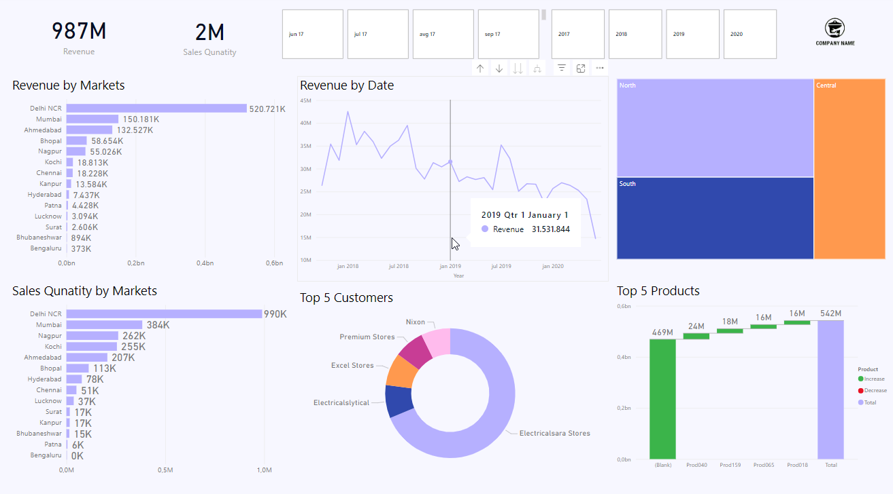

# Microsoft Power BI Sales Insigths

Sales Insigths using Power BI and SQL.

This project contains:
- data analysis using SQL
- data cleaning
- build dashboard

## Data Analysis using SQL

Show all customer records. <br/>
```SELECT * FROM customers;```

Show total number of customers. <br/>
```SELECT count(*) FROM customers;```

Show distinct product codes. <br/>
```SELECT distinct product_code FROM transactions where market_code='Mark001';```

Show transactions where currency is US dollar. <br/>
```SELECT * from transactions where currency="USD";```

Show transactions in 2020 join by date table. <br/>
```SELECT transactions.*, date.* FROM transactions INNER JOIN date ON transactions.order_date=date.date where date.year=2020;```

Show total revenue in year 2020. <br/>
```SELECT SUM(transactions.sales_amount) FROM transactions INNER JOIN date ON transactions.order_date=date.date where date.year=2020 and transactions.currency="INR\r" or transactions.currency="USD\r";```

Show total revenue in year 2020, January Month. <br/>
```SELECT SUM(transactions.sales_amount) FROM transactions INNER JOIN date ON transactions.order_date=date.date where date.year=2020 and and date.month_name="January" and (transactions.currency="INR\r" or transactions.currency="USD\r");```

Show total revenue in year 2020. <br/>
```SELECT SUM(transactions.sales_amount) FROM transactions INNER JOIN date ON transactions.order_date=date.date where date.year=2020 and transactions.market_code="Mark001";```

## Power BI Dashboard Preview


